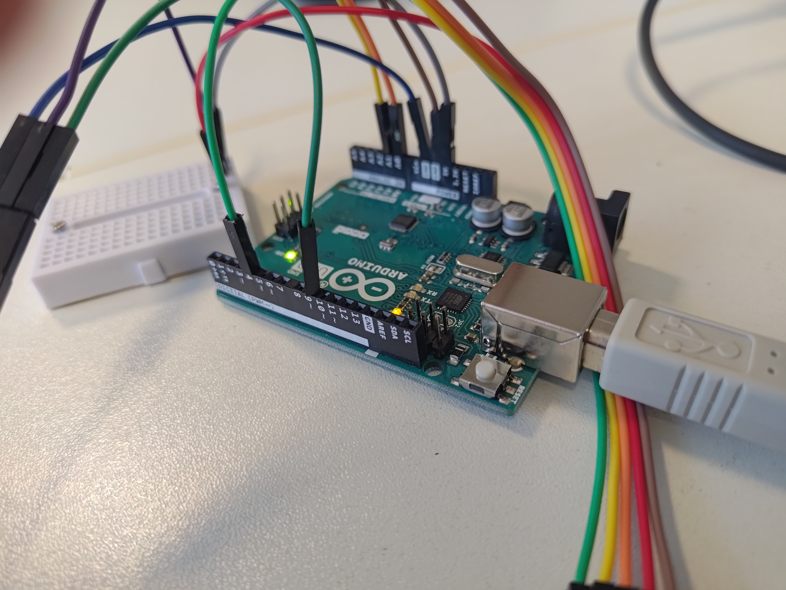
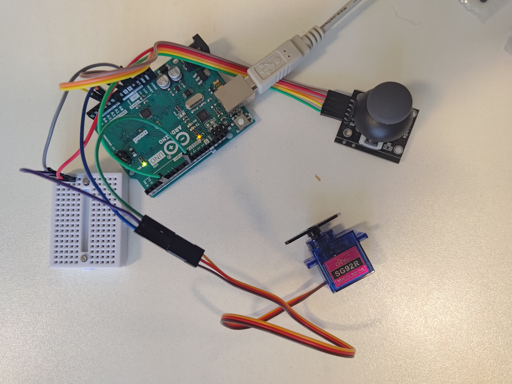

# Projet : Contrôle hybride d’un servomoteur à rotation continue (Arduino + Interface Python)

## Objectif

Ce projet permet de contrôler un **servomoteur à rotation continue** via deux modes d'interaction :

- Un **joystick physique** connecté à une carte **Arduino Uno**
- Une **interface graphique Python**

L’utilisateur peut passer dynamiquement d’un mode à l’autre et observer les effets en temps réel.

---

## Composants matériels

- Arduino Uno  
- Servomoteur à rotation continue (signal sur D9)  
- Joystick analogique :
  - VRx connecté à A0 (axe X)
  - SW connecté à D4 (bouton)
- Câblage de base (breadboard, fils Dupont)
- Ordinateur sous Windows avec Python installé

---

## Fonctionnalités de l’interface Python

- Contrôle du servomoteur :
  - Boutons `Gauche`, `Droite`, `Stop`
  - Curseur de **vitesse**
  - Curseur de **position** (angle 0 à 180°, style manivelle)
- Boutons de **remise à zéro** (vitesse et position)
- Sélecteur de **mode de contrôle** (`Python` ou `Joystick`)
- Image de fond personnalisable (`fond.jpg`)
- Animation visuelle lors du mode aléatoire (texte qui change de couleur)
- Communication série en temps réel avec l’Arduino

---

## Fonctionnement côté Arduino

- Lit l’axe X du joystick via une entrée analogique (A0)
- Lit l’état du bouton (SW) pour inverser la direction
- Reçoit des instructions depuis le PC via le port série
- Gère dynamiquement le mode actif (`Joystick` ou `Python`)
- Envoie ou applique la vitesse de rotation du servomoteur

Voici le schéma de branchement du projet :


---

## Structure du projet

```
/projet-servo-hybride
├── arduino_servo/
│   └── arduino_servo.ino     ← Code Arduino
├── interface_servo.py        ← Interface graphique Python
├── fond.jpg                  ← Image de fond de l’interface
├── README.md                 ← Présentation du projet
```

---

## Aperçu
Voici quelques photos du montage : 





